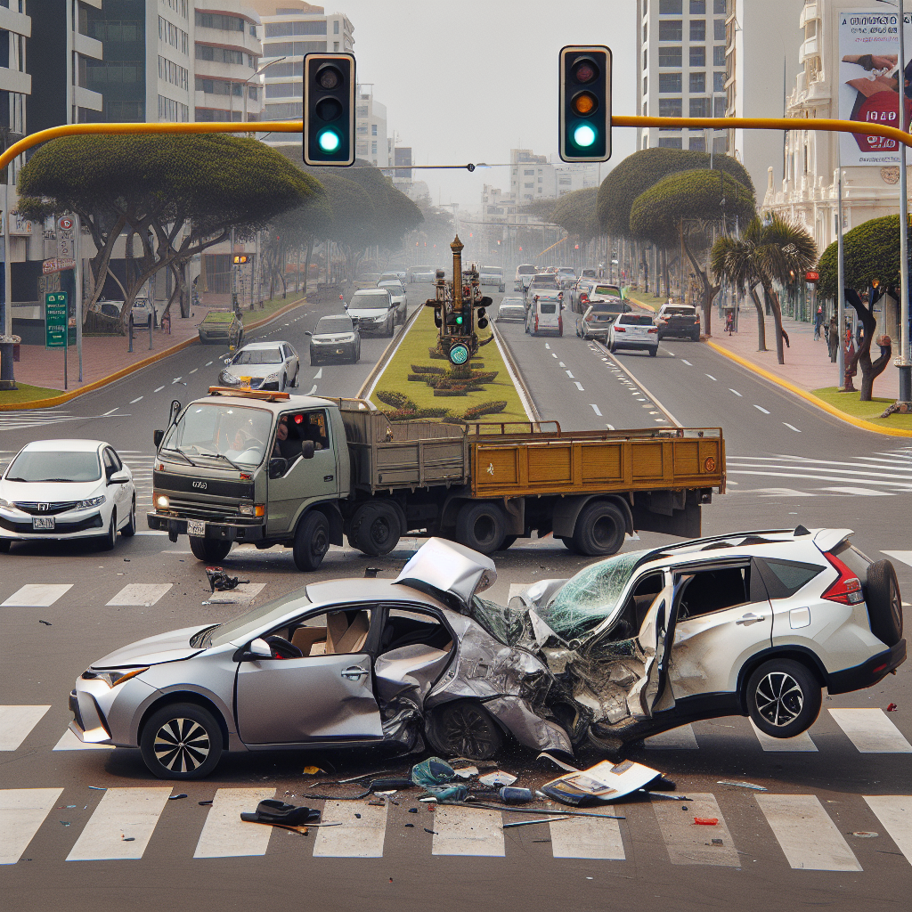

# Reporte de Accidente de Tránsito

## 1. Datos Generales del Incidente
- **Fecha:** 30 de octubre de 2025  
- **Hora:** 10:15 a.m.  
- **Lugar:** Intersección de la Av. José Pardo con la Calle 2 de Mayo, Miraflores.  
- **Descripción del entorno:** Vía urbana con semáforos en funcionamiento. Día soleado y sin lluvia. Tráfico moderado.  

## 2. Vehículo y Conductor 1 (Auto)
- **Conductor:** Ana María Rojas Cáceres  
- **Documento de identidad:** 47852136-E  
- **Domicilio:** Calle Cantuarias 150, Miraflores, Lima  
- **Teléfono:** 987 654 321  
- **Licencia de conducir:** A-1, N° 12345678, Vigencia hasta 2030  
- **Vehículo:** Auto sedán, marca Toyota, modelo Corolla, año 2020  
- **Placa:** B2K-789  
- **Daños:** Daño severo en la parte lateral derecha delantera y puerta.  
- **Información del seguro:**  
  - **Compañía:** Pacífico Seguros  
  - **N° de Póliza:** 0123456789  
  - **SOAT:** Vigente (Compañía La Positiva, N° 9876543210)  

## 3. Vehículo y Conductor 2 (Camioneta)
- **Conductor:** Juan Carlos Pérez Soto  
- **Documento de identidad:** 40125874-C  
- **Domicilio:** Av. Comandante Espinar 550, Miraflores, Lima  
- **Teléfono:** 999 888 777  
- **Licencia de conducir:** A-3, N° 87654321, Vigencia hasta 2029  
- **Vehículo:** Camioneta SUV, marca Honda, modelo CR-V, año 2022  
- **Placa:** E5G-456  
- **Daños:** Daño moderado en la parte frontal (parachoques y capó).  
- **Información del seguro:**  
  - **Compañía:** Rímac Seguros  
  - **N° de Póliza:** 0987654321  
  - **SOAT:** Vigente (Compañía Rímac Seguros, N° 1023456789)  

## 4. Descripción Detallada del Suceso
Según la versión de la Sra. Rojas (Auto), ella circulaba por la Av. José Pardo con luz verde a su favor. De forma repentina, la camioneta, conducida por el Sr. Pérez, cruzó la intersección sin respetar la señal de tránsito, provocando la colisión. El Sr. Pérez (Camioneta), por su parte, indicó a las autoridades que cruzó la intersección al ver el semáforo en ámbar, pero no pudo frenar a tiempo.

## 5. Testigos
- **Testigo 1:** Roberto Gutiérrez (45). Se encontraba en la vereda de la esquina. Afirmó que el auto de la Sra. Rojas tenía la luz verde y la camioneta de color negro pasó el semáforo en rojo.  
- **Testigo 2:** Laura Mendoza (30). Esperaba en el paradero de bus cercano. Confirmó que la camioneta intentó cruzar rápidamente la intersección.  

## 6. Autoridad Interviniente
- **Policía Nacional del Perú:** Comisaría de Miraflores. Agente a cargo: Suboficial PNP Miguel Arcos.  
- **Atención de Emergencia:** Personal de Serenazgo de Miraflores acudió al lugar para controlar el tráfico y asistir a los implicados. No se requirió atención médica de emergencia, ya que solo se registraron daños materiales.  

## 7. Conclusiones y Notas Adicionales
Se levantó el atestado policial correspondiente y ambos vehículos fueron trasladados a la comisaría para continuar con las investigaciones.  
La Sra. Rojas presentó una contusión leve en el hombro, pero se negó a ser trasladada a un centro médico.  
No se emitieron multas en el lugar, ya que la responsabilidad se determinará con las investigaciones posteriores.  
Ambos conductores notificaron a sus respectivas compañías de seguros para iniciar el proceso de reclamo.